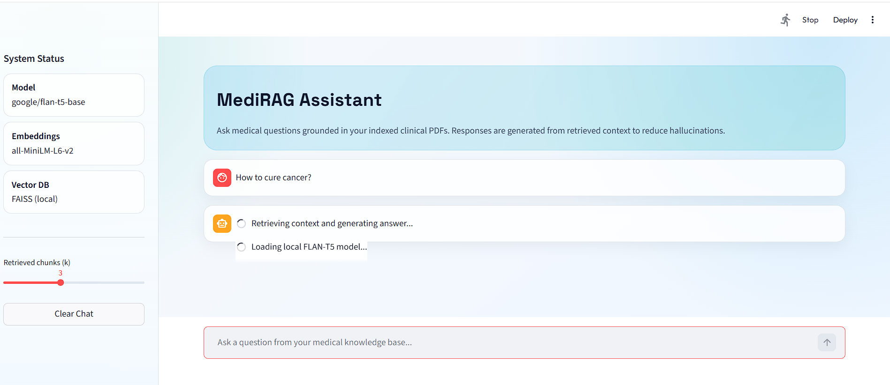
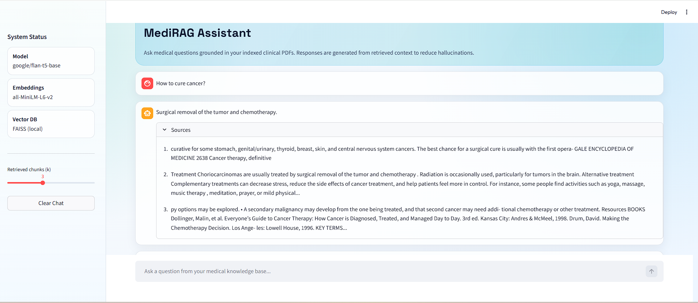
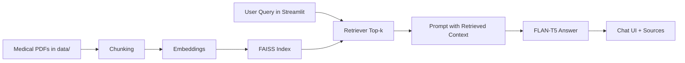

# Medical RAG Bot

A clean, local Retrieval-Augmented Generation chatbot for medical PDFs, powered by FAISS + Hugging Face models + Streamlit.

<p align="left">
	
	
	
	
</p>

## One-Minute Setup

If you want the fastest possible start, run these commands:

```bash
uv sync
python src/memory_for_llm.py
streamlit run app.py
```

Then open `http://localhost:8501`.


### Screenshots

Add screenshots for key states of your app:

```text
assets/screenshots/home1.png
assets/screenshots/home2.png
```

Example markdown once images are added:

```md


```

## Why This Project

Medical questions need grounded answers, not guesses.
This project retrieves relevant context from your PDF knowledge base before generating a response, helping reduce hallucinations.

## Features

- Local PDF-based medical knowledge assistant
- FAISS vector database for fast semantic retrieval
- Hugging Face embeddings: `sentence-transformers/all-MiniLM-L6-v2`
- Local text generation with `google/flan-t5-base`
- Beautiful Streamlit chat UI with source snippets
- Cached model/vector loading for faster repeated queries

## Architecture



## Project Layout

```text
medical_rag_bot/
|- app.py                           # Streamlit UI and RAG flow
|- main.py
|- pyproject.toml                  # Dependencies and project metadata
|- README.md
|- data/                           # Place your PDF files here
|- src/
|  |- memory_for_llm.py            # Build FAISS index from PDFs
|  |- connect_memory_to_llm.py     # CLI-based RAG script
|- vector_store/
|  |- faiss_index/
|  |  |- index.faiss
```

## Quick Start

### 1) Install dependencies

Option A: uv (recommended)

```bash
uv sync
```

Option B: pip

```bash
python -m venv .venv
.venv\Scripts\Activate.ps1
pip install -e .
```

### 2) Add PDF files

Put your medical PDFs inside:

```text
data/
```

### 3) Build or refresh vector index

```bash
python src/memory_for_llm.py
```

### 4) Run the app

```bash
streamlit run app.py
```

Open the local URL shown in the terminal, usually `http://localhost:8501`.

## Tech Stack

- Frontend: Streamlit
- Retrieval: LangChain + FAISS
- Embeddings: sentence-transformers/all-MiniLM-L6-v2
- Generation: google/flan-t5-base
- Runtime: Python 3.12+

## How It Works

1. You ask a question in the Streamlit chat.
2. The retriever searches FAISS for relevant chunks.
3. Retrieved context is injected into a strict RAG prompt.
4. FLAN-T5 generates a context-grounded answer.
5. The UI shows the response and source previews.

## Configuration Defaults

- LLM: `google/flan-t5-base`
- Embeddings: `sentence-transformers/all-MiniLM-L6-v2`
- Vector store path: `vector_store/faiss_index`
- Retrieval size: configurable with sidebar slider in app

## Troubleshooting

### Missing torchvision error

If terminal logs show `ModuleNotFoundError: No module named 'torchvision'`, install torchvision in the same environment:

```bash
uv add torchvision
```

or

```bash
pip install torchvision
```

Then restart Streamlit.

### Empty or weak answers

- Ensure PDFs exist in `data/`.
- Rebuild index using `python src/memory_for_llm.py`.
- Increase retrieval `k` in the sidebar.

### FAISS load problems

- Confirm files exist under `vector_store/faiss_index/`.
- Regenerate index from your PDFs.

### Slow first response

- First run is slower because model files load into memory.
- Subsequent responses are faster due to caching.

## Safety Notice

This project is for educational and prototyping use.
It is not a certified medical system and must not replace professional medical advice.

## Roadmap Ideas

- Add citation links with page numbers
- Add conversation memory window
- Add model selection in sidebar
- Add Docker setup for one-command launch

## Contributing

Contributions are welcome.

1. Fork the repository.
2. Create your feature branch.
3. Make your changes and test locally.
4. Commit with a clear message.
5. Open a pull request with a short description and screenshots if UI changed.

### Suggested local workflow

```bash
git checkout -b feature/your-feature-name
uv sync
python src/memory_for_llm.py
streamlit run app.py
```

### PR quality checklist

- Keep changes focused and scoped
- Update README when behavior changes
- Verify vector index can still be created
- Confirm app launches and answers queries

## License

MIT.
